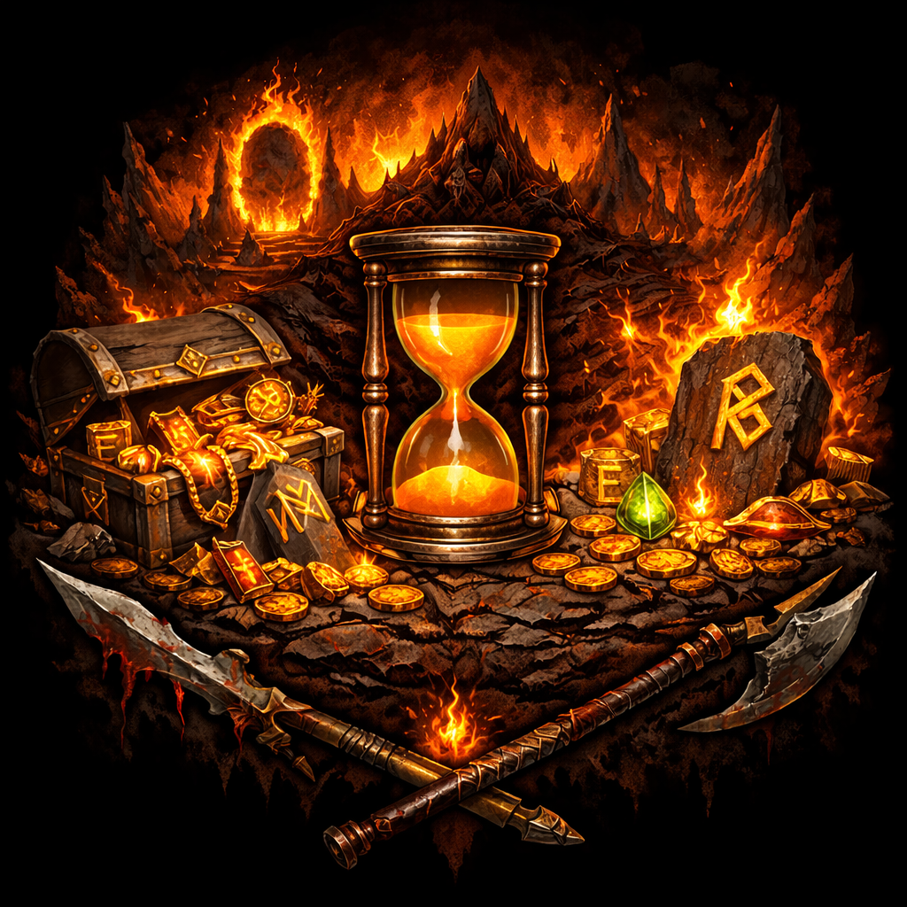

# Diablo II Run Counter

A web-based farming tracker for Diablo II that helps you monitor your runs, track loot drops, and analyze farming efficiency across different farming spots and raid rushes. Best used on a second monitor. **[Try it now](https://d2r-counter.com/)**

<p align="center">
  
</p>

## Features

### Run Tracking

- Track individual farming runs with timing
- Record loot drops (uniques, sets, high runes, keys)
- Pause and resume runs as needed
- Real-time timer display with today's average run time
- Support for multiple farming spots
- Create custom farming spots for locations not in the default list

### Rush Tracking

- Separate tracking mode for rush runs
- Support for Normal, Nightmare, and Hell difficulties
- Individual rush timing and statistics

### Loot Tracking

- Unique items counter and toggle
- Set items counter and toggle
- High rune detection
- Key drops for Countess, Nihlathak, and Summoner runs
- Herald kill tracking for Terror Zones

### Data Management

- All data stored locally in browser (`localStorage`)
- Export data as JSON for backup and sharing
- Import saved JSON backups to restore data
- Reset individual farming spot statistics as needed
- **No cloud, no cookies** — nothing is collected or transmitted

## Quick Start

1. **Open the tracker** — open `index.html` in your web browser
2. **Select a farming spot** — choose from the dropdown or create a custom spot
3. **Start a run** — click "Start / New Run" to begin timing
4. **Record loot** — click loot buttons as items drop; use +/− to adjust counts
5. **Complete the run** — click "Complete" to save, or "Pause Run" to step away
6. **View statistics** — click "All Stats" to see efficiency breakdowns, sort by various metrics, and export data

> **Tip:** Click "Discard" if there's an issue with your data (e.g. the timer was left running overnight).

## File Structure

```
index.html      Main run tracker interface
stats.html      Statistics and analytics page
app.js          Core tracker logic and UI
stats.js        Statistics processing and analytics
shared.js       Shared utilities, data storage, and API
styles.css      Styling (dark theme)
assets/
  spots/        Farming spot images
  ui/           UI assets
```

## Statistics

- **Efficiency Score** — weighted calculation that values high rune drops and keys above uniques/sets
- **Drop Rates** — unique rate, set rate, and high rune rate as percentages
- **Ranking** — visual indicators for top and bottom performing spots
- **Time Analysis** — average run time, fastest rush time

## Tips

- **Key Spots**: Countess, Nihlathak, and Summoner runs include automatic key tracking
- **Terror Zones**: Best used for sessions with Shards
- **Data Backup**: Regularly export your data to protect against browser storage loss

## Issues & Ideas

Open an issue or reach out on the [D2R Discord](https://discord.gg/d2resurrected).

---

### Made by RedVarg91

[](https://discord.gg/d2resurrected)
[](https://www.twitch.tv/redvarg91)
[](https://www.youtube.com/@redvarg91)
[](https://github.com/emilmadry)
